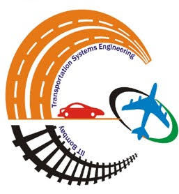
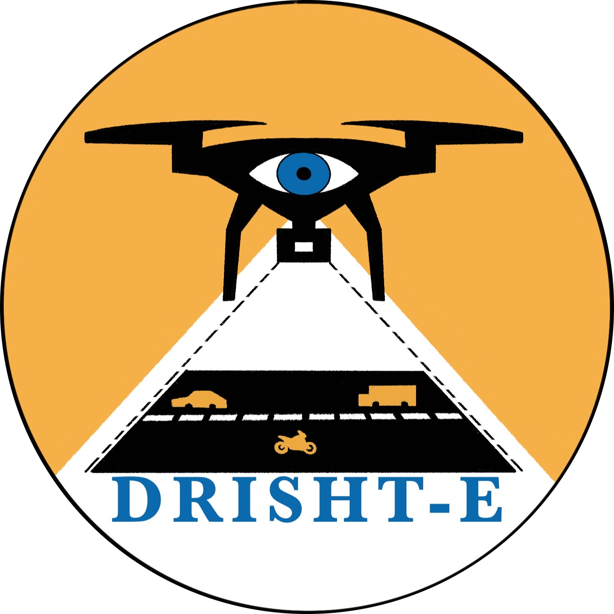
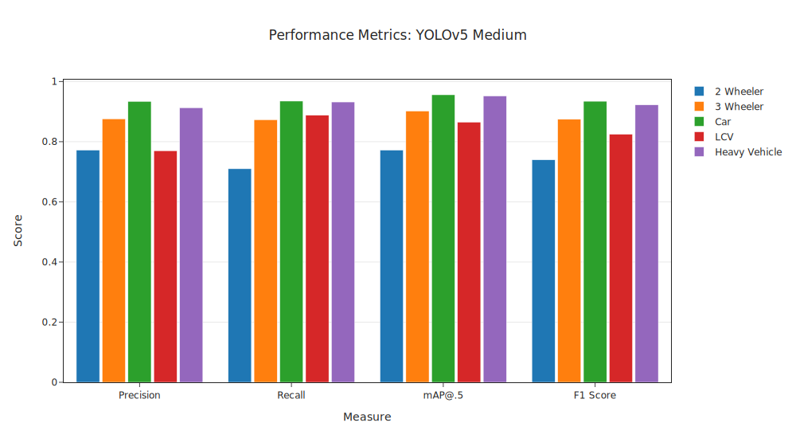
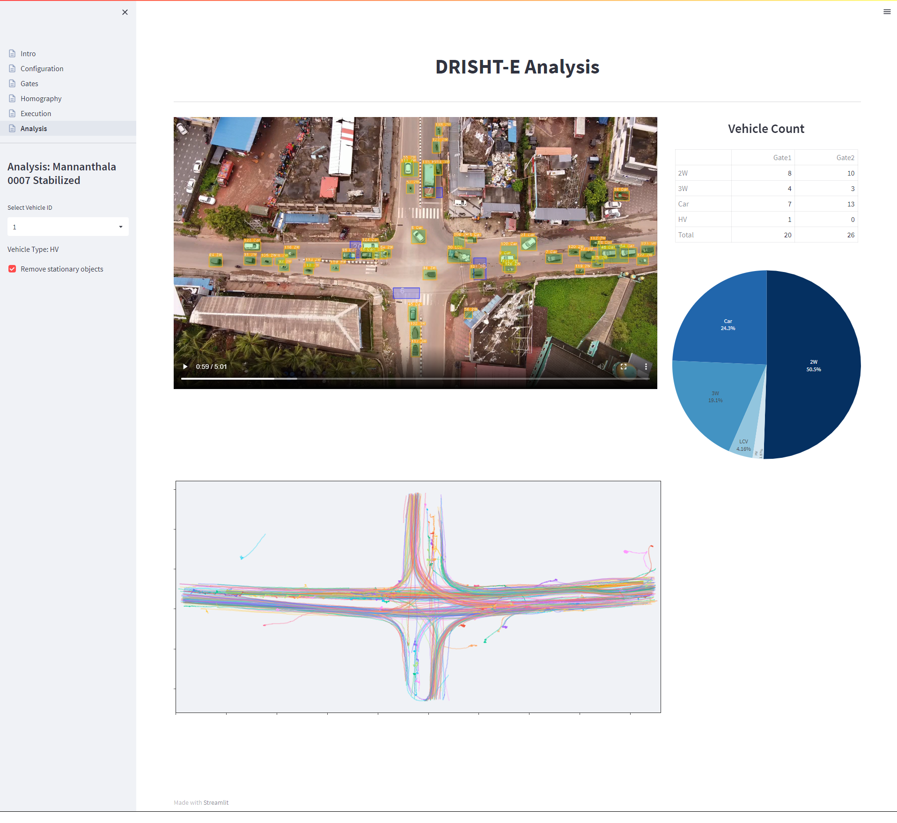
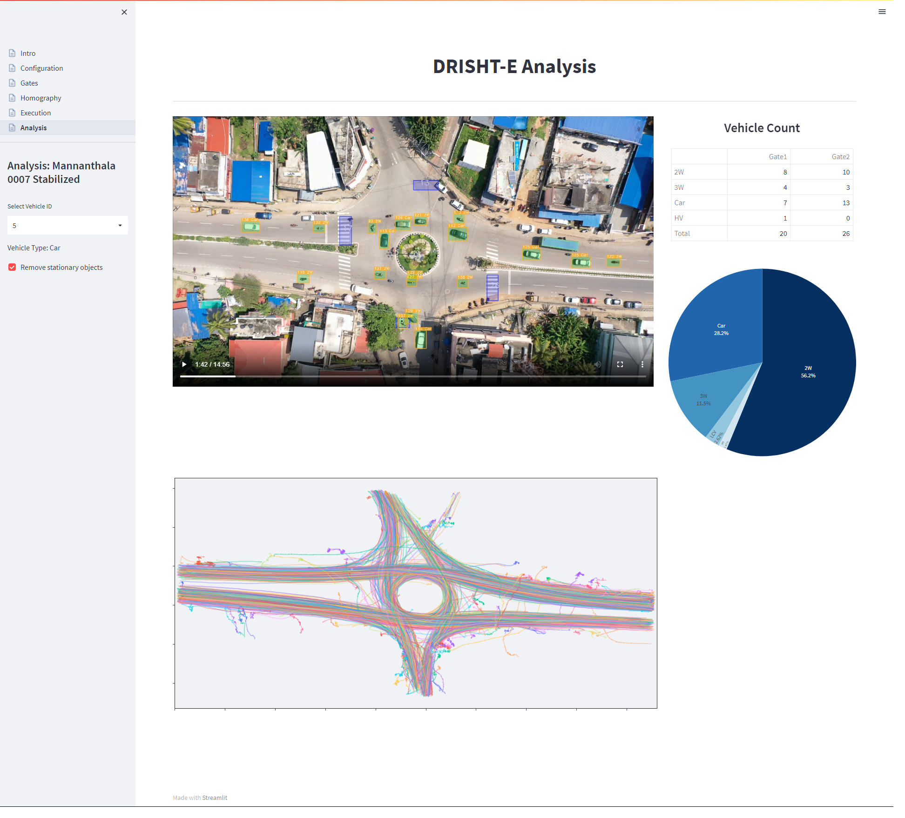

<!-- PROJECT LOGO -->
<table border="0" align="center">
 <tr>
    <td></td>
    <td>
    <h1 align="center">DRISHT-E</h1>
    <h3 align="center">DRone Integrated System for Heterogenic Traffic Extraction</h3>
    </td>
    <td></td>
 </tr>
</table>

  

 
 

  A tool to detect, track and analyze vehicle trajectory from drone footages.

 

DRISHT-E is a novel offline video based fully-automated traffic
data extractor tool for non-lane-based traffic conditions. The objective of this software is to make it compatible with mixed traffic conditions, including
* Signalized Intersections
* Midblock Segments
* Roundabout

## Vehicle Detection 

### Dataset
Drone-based video data was taken from multiple locations at different times of the day with varying geometric and traffic characteristics. The locations include parts of urban cities in India, namely:
- Kerala
- Mumbai
- Gujarat
- Bhopal
  
A novel dataset of annotated drone footage consists of 186K frames with over 4M annotations. Annotated vehicle categories include `2-Wheeler` , `3-Wheeler`, `Car`, `LCV` and `Heavy-Vehicle` (Bus & Truck).

### Training
`YOLOv5` is used to train on this dataset with 2 Nvidia 1080Ti GPUs. Trained models are exported to torchscript format to be used in the software.
  
### Results

## Vehicle Tracking
DRISHT-E uses two trackers to track vehicle detections:
 1. CSRT (Channel and Spatial Reliability of Discriminative Correlation Filter)
 2. KCF (Kernelized Correlation Filter)
   
These trackers are interchangeably used to maximise the processing speed and reduce noise while maintaining tracking accuracy.
  
## DRISHT-E Software
The software is created using python using frameworks like 
<!-- |  | |
| --------- | ------- |
| PyTorch, TorchVision | Model inference & processing |
| OpenCV | Video & Image operations |
| Numpy, Scipy | Numeric operations |
| Pandas | Trajectory data analysis |
| Streamlit | Visualization | -->

* `PyTorch,TorchVision`: Model inference & processing
* `OpenCV`: Video & Image operations
* `Numpy`, Scipy: Numeric operations
* `Pandas`: Trajectory data analysis
* `Streamlit`: Visualization

### User Interface

## Info
This project is currently under development. Much of the data, especially in training and results are redacted due to the ongoing research.